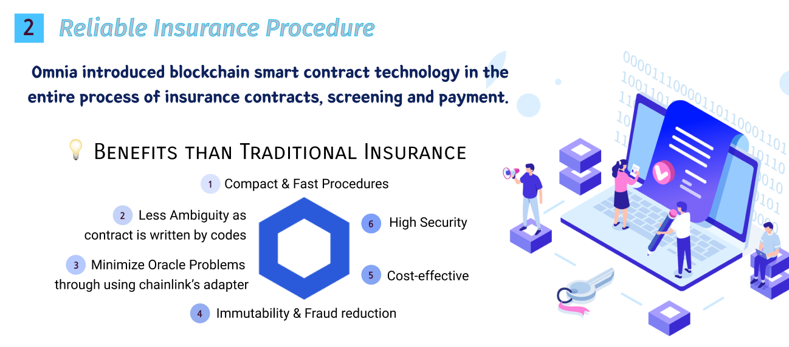

# Chainlink Virtual Hackathon Spring 2021
## Omnia: Blockchain-based P2P Insurance Platform
### https://master.dnfhpi5eebvuf.amplifyapp.com/


<p align="center"></p>


[](#license)

<h3>1.  Member </h3>

| Name   	| Role                         	|
|--------	|-------------------------------	|
| HeeYoun Kim  	| Back-end Developer |
| YongWook Lee  	| Front-end Developer |
| JeongMin Lee	| SmartContract Developer	|
| Chaewon Jeong 	| Project Manager |

[](#license)


<h3>2.  Inspiration  </h3>

### Omnia is a ***blockchain-based p2p(peer-to-peer) insurance platform***. 

Personally, we were dissatisfied with the chronic problems of the existing insurance industry.  
For example, because of the issue of revenue structures, there were complaints about the inability of insurance to be generated for small needs, large amounts to be paid to cover risks, and complex contract procedures.  
We had only vaguely thought of solving the problem, but through this opportunity, we were able to solve the problems one by one by designing and developing a p2p service that specifically introduced blockchain.

#### Omnia's Vision
“Uni navi ne committas omnia” is a Latin saying, ‘Don’t leave everything in one boat.’
As such, we decided to make catchphrase in hopes of safely distributing risks through our platform.
Namely, We created a platform called ‘Omnia’ to give people a well-being life by creating an insurance platform that can safely distribute risks with blockchain.


[](#license)

<h3>3.  Service Features </h3>

We serve as a platform for connecting small needs that individuals have. Specifically, Recruit people who want to be guaranteed risks, and create insurance groups when a certain number of people gather in our platform. Then, Customers check the price and benefits and get insurance with higher benefits and lower costs than traditional insurance. Finally, in the total amount of insurance money each paid, insurance money shall be paid in the event of an accident. At this time, the entire process from subscription to payment of screening was designed to introduce smart contract technology. <br>

[](#license)

<h4> Service Process </h4>

<br>
<h4> Omnia's Advantages </h4>

It was difficult to receive insurance money because of an accident in the existing p2p insurance. Of course, there are cases in some insurance that reduce up to 90 percent, but it is rare. The reason may be that there are risks in terms of profitability. Omnia intends to use blockchain technology not only for the process of insurance procedures, but also for the formation of profitable models. Using DEFI, it is intended to be returned to the user by dividing the amount collected from the entire population, excluding the premium deducted. At this time, the fee for the platform was set very low at 5%. Still, the company can take a stable profit model. This is because there is revenue operated by fees and DEFI. Currently, we envision a model for making DAI of MakerDAo and Staking of AAVE <br>
<br>

 In the current insurance industry, the use of blockchain is being partially utilized. Omnia intends to provide efficient infrastructure by introducing smart contract technology throughout the entire process, including subscription, screening, and insurance payments. Omnia has more advantages than the traditional insurance industry.
 First of all, it has simple and fast procedures, so you can experience high UX in terms of consumers, and it is also economical for the company. If operating costs decrease, it will also be replaceable with a large amount that can be returned to consumers. In addition, contracts are all written in code, thus reducing the ambiguity of contracts. Blockchain technology will provide high security, reduced fraud, and immutability.
Finally, we also try to minimize the chronic 'oracle problem' experienced by existing blockchain industries using chainlink's adapter.<br>
<br>

<br>
We also considered ways to improve UX from the perspective of consumers. So what we've come up with is two functions. It will gradually introduce functions such as ordering and consulting by voice by linking voice recognition api inside the web. It is expected that this will improve the quality of experience for the underprivileged who are struggling with the IT UI.
In addition, in addition to the automatic upload function that Verifier automatically sends documents, we will also introduce the function to manually upload insurance review documents by linking OCR API. As we are still students, we can't cope with cloud charges because we can't afford it now, so we haven't developed each technology and connected it completely, but we will also connect additional functions when we carry out our business in the future.


[](#license)

<h3> 4. Service Architecture </h3>


The following is our servie architecture.

Our platform introduced blockchain technology throughout the entire process of insurance contracts, such as purchasing insurance, receiving insurance premiums, and screening. Users check and purchase insurance. Direct variables of Contract such as "Insurance Fee Amount & Inflow, Outflow" are recorded on the Ethereum network as on-chain smart contracts. The metamask was then linked to web3.js. General data is written to storage(MySQL).

The concept of Verifier emerges in the process of screening before users receive insurance money. Since it is a demonstration, it is not possible to recruit verifiers realistically, so it was assumed and set up when the business was expanded. At this point, Verifier can be considered to be a person who can officially verify examination documents in the course of contracts such as hospitals and courts. When a user is verified by an external party called verifier, this content is delivered to the nodes directly configured through chainlink api, which is sent back to the on-chain contact. In addition, we plan to link external adapters to prevent Oracle problems.

Omnia operated a web server and also linked AAVE Protocol to utilize defi. AAVE is a coin lending platform for obtaining interest on deposits and borrowing assets. Although the deposit rate varies for each coin, the annual apy is about 5.91% based on DAI. Therefore, we have formed a system that earns profits through interest through the deposit of DAI, a stable coin, and returns some of its profits to customers who have not had an accident.

To be specific, transfer the ether sent to the metamask to the AAVE Reserve Lending Pool. The transferred ether can be stored in the AAVE Wallet and converts the ETH into DAI through the built-in SWAP functionality of the AAVE platform. The DAI is deposited in the AAVE Staking Pool, and the revenue generated at this time is stored in the AAVE Wallet and transferred to the Metamask Wallet. For liquidity, it was developed that all amounts transferred to the Omnia platform could be automatically deposited into Pool at a set rate, rather than staking.
<br>

[](#license)

<h3> 5. Develop Process </h3>


Using React, express(nodejs framework), we made web server for communicating with client. React for client screen, express for backend server and remix IDE for smartcontract deploy. Also we made smartcontract for the insurance on the insurance page. This operates insurance payment when accidents when an accident occurred and it was certified. It is also operated when an accident does not occur and is overdue. The chainlink node will be built for importing the insurer's external data into the blockchain network. Also, we made database for managing user's data using MySQL and connected AAVE API for defi staking. 

###  Languages and Frameworks & version 

#### Common

| Languages and Frameworks | version |
| --- | --- |
| yarn | 1.22.10 |

#### Client

| Languages and Frameworks | version |
| --- | --- |
| react | 17.0.2 |
| react-dom | 17.0.2 |
| react-router-dom | 5.2.0 |
| react-scripts | 4.0.3 |
| react-transition-group | 4.4.1 |
| styled-components | 5.2.3 |
| typescript | 4.1.2 |

#### Server

| Languages and Frameworks | version |
| --- | --- |
| node.js | 12.18 |
| postgreSQL | >=11 |
| nvm | 0.38.0 |
| cors | 2.8.5 |
| ejs | 3.1.6 |
| express | 4.17.1 |
| express-react-views | 0.11.0 |
| express-session | 1.17.1 |
| morgan | 1.10.0 |
| mustache | 4.2.0 |
| nodemon | 2.0.7 |
| path | 0.12.7 |
| session-file-store | 1.5.0 |
| ts-node | 9.1.1 |

#### Smart Contract

| Languages and Frameworks | version |
| --- | --- |
| geth | 1.8+ |
| solidity compiler | 0.6.12 |


---
### Details
#### a. Front-end
> ***1. Main Page*** : In this page, there are important three features about service omnia (Reimbursement, Reliable procedure, User-friendly interface). Read informations carefully at this page. At the end of this page there is footer which has member's data <br><br>
> ***2. Insurance List Page*** : In this page, users can select what insurance is fit to him or her. There are six kinds of insurance (Health care, Pet, Car Rental, Accomodation, Kickboard, Keyperson). If user wants to know about insurance, just click the image. And then users can know that insurance's features. Also at the end of page, there is a insurance suggest program. If you curious that what insurance is fit to you click the suggest! At last you also sign up to insurance through Metamask transaction. <br><br>
> ***3. My Page*** : At this page, users can watch all of informations about user's data and insurance'data. Such as users' address, users'confirmation code, due date etc ... If you want to expire insurance, It is really easy. Just click withdraw button! <br>
#### b. Back-end

**< Overview >**

    

> Server made with Express js (Node js), Typescript and MySQL. Server deployed with Heroku 
(Cloud Application Platform)

**< API >**

***> 1. Purchase Insurance ( '/api/create' )***
> 
> - request -> User can purchase insurance with this request. It requires user's confirmation code, user's name, Insurance's end date
> and user's wallet address.
> ```js
> // Request Body
> {
>    confirmationCode: String,
>    name: String,
>    dueDate: Date,
>    walletAddress: String
> }
> ```
> 
> - DB Query -> Insert user's data into insurance table.
>```mysql
>INSERT into insurance(confirmation_code, name, due_date, wallet_address) VALUES(?, ?, ?, ?)
>```
> 
> - response -> If there is an error, response error or not response success code.
>```js
>// Success Response Body
>{
>   code: 1
>}
>
>// Fail Response Body
>{
>   code: 0
>}
>```
> 
***> 2. Get My Insurance Data ( '/api/myPage' )***
> 
> - request -> User can check he or she's insurance data with this request. It requires user's wallet address.
>```js
>// Request Body
>{
>   walletAddress: String
>}
>```
> 
> - DB Query -> SELECT insurance data which user purchased from insurance table.
>```mysql
>SELECT * FROM insurance WHERE wallet_address=?
>```
> 
> - response -> If there is an error, response error or not response insurance data
>```js
>// Response Body
>{
>   confirmationCode: String,
>   name: String,
>   dueDate: Date
>}
>```
>

#### c. Smart Contract

> 1. ***Client structure***: Depending on the state and the amount of money deposited by the person, 0 means not insurance payment target and 1 means 
> insurance payment target
> ```js
> struct Client {
>        uint status; // not tartget = 0, target = 1
>        uint balances; // balances, indexed by address
> }
> ```
> 2. ***ClientInfo Mapping*** : Created to map with address => client structure format and address as key KeyList Address Array: To store
> the addresses of the people who have deposited and to count the total
> number of people later on. Mappings are not Iterative, so counting is
> inconvenient because of this, I make this array.
> ```js
> mapping(address=>Client) private clientInfo;
> address payable[]  keyList;
> ```
> 3. The things in the constructor() **1** Ether must be initially deposited by the issuer to issue the contract.
>
> 4. using **setPublicChainlinkToken()** -> using chainlink token Oracle -> External Adapter Oracle Address I Use JobId -> External Adapter id
> Clstatus -> First of all false
> 
> ```js
> constructor() public payable {
>        // require(msg.value == 1 ether, "1 ehter initial insurance funds required");
>        owner = msg.sender;
>        unit = 10**18;
>        // remain = 1;
>        setPublicChainlinkToken();
>        oracle = 0xAA1DC356dc4B18f30C347798FD5379F3D77ABC5b;
>        jobId = "982105d690504c5d9ce374d040c08654";
>        fee = 0.1 * 10 ** 18; // 0.1 LINK
>        clstatus = false;
>        weth = 0xd0A1E359811322d97991E03f863a0C30C2cF029C;
>        WETH = IWETH(weth);
>        ILendingPoolAddressesProvider provider = ILendingPoolAddressesProvider(lendingPoolAddressesProviderAddr);
>        pooladdr = provider.getLendingPool();
>        ILendingPool poolInstance = ILendingPool(pooladdr);
>        lendingPool = poolInstance;
>        aWETH = IAToken(poolInstance.getReserveData(weth).aTokenAddress);
>    }
> ```
> 
> 5. **RequestAlarmClock,fullfillAlarm** —> supplied by the chainlink external adapter, and entered a few seconds in the requestalarmclock, then replaced the status value with true after the chainlink Oracle has run it all automatically.
>```js
>function requestAlarmClock(uint256 durationInSeconds) public returns (bytes32 requestId) 
>    {
>        Chainlink.Request memory request = buildChainlinkRequest(jobId, address(this), this.fulfillAlarm.selector);
>        // This will return in 90 seconds
>        request.addUint("until", block.timestamp + durationInSeconds);
>        return sendChainlinkRequestTo(oracle, request, fee);
>    }
>    
>function fulfillAlarm(bytes32 _requestId, uint256 _volume) public recordChainlinkFulfillment(_requestId)
>    {
>        clstatus = true;
>    } 
>```
> 6. ***authorizeLendingPool(), depositTolending(), withdrawFromlending(), _safeTransferETH*** —>  functions that deposit and withdraw all the money in the contract into the lendingpool.
> 
>```js
> function authorizeLendingPool() public{
>        require(owner == msg.sender);
>        WETH.approve(pooladdr, uint256(-1));
>    }
>    
> function depositTolending() public payable {
>        require(owner == msg.sender);
>        WETH.deposit{value: msg.value}();
>        lendingPool.deposit(address(WETH), msg.value, msg.sender, 0);
>    }
>    
> function withdrawFromlending() external {
>        userBalance = aWETH.balanceOf(msg.sender);
>        aWETH.transferFrom(msg.sender, address(this), userBalance);
>        lendingPool.withdraw(address(WETH), userBalance, address(this));
>        WETH.withdraw(userBalance);
>        _safeTransferETH(msg.sender, userBalance);
>    }
>    
> function _safeTransferETH(address to, uint256 value) internal {
>        (bool success, ) = to.call{value: value}(new bytes(0));
>        require(success, 'ETH_TRANSFER_FAILED');
>    }
>```
>
> 7. ***giveRight*** —>Contract Issuer makes the status of a particular client 1 If clstatus is true (i.e. the original goal was to get data from an external adapter when certified by the insurer and change the status corresponding to the person's address to 1, but after a certain period of time using alarm clock as an alternative, the contract issuer enters and executes the insured's address).
> 
>```js
>function giveRight(address targetClient) public {
>        require(owner == msg.sender);
>        if(clstatus == true)
>        {
>            clientInfo[targetClient].status = 1;
>            clstatus = false;
>        }
>    }
>```
> 8. ***withdrawForadmin()*** —> All balance withdrawals in the contract
> ```js
>function withdrawForadmin() public {
>        require(owner == msg.sender);
>        owner.transfer(address(this).balance);
>    }
> ```
> 
> 9. ***withdrawForclient(uint256 amount)*** —> a function that allows withdrawals and payments to be made only by those authorized to pay insurance.
> 
>```js
>function withdrawForclient(uint256 amount) public {
>        require(clientInfo[msg.sender].status == 1); // can withdraw when they have right to withdraw.
>        require(address(this).balance >= amount);
>        remain -= amount;
>        amount = amount * unit;
>        // clientInfo[msg.sender].balances -= amount;
>        clientInfo[msg.sender].status = 0;
>        numOfrecevied++;
>        msg.sender.transfer(amount);
>    } 
>```
> 10. ***divideInsurancePayment()*** —> Distribute insurance money to those who are not involved in the accident.
>
>```js
>function divideInsurancePayment() public {
>        require(owner == msg.sender);
>        moneyTohost = (remain*unit) + (address(this).balance * 5 / 100);
>        owner.transfer(moneyTohost);
>        numOfdistribute = keyList.length - numOfrecevied;
>        dtbMoney = (address(this).balance / numOfdistribute);
>        for (uint i = 0; i< keyList.length; i++)
>        {
>            if(clientInfo[keyList[i]].status == 0)
>            {
>                keyList[i].transfer(dtbMoney);
>                clientInfo[keyList[i]].balances = 0;
>            }
>        }
>     }
>```
>
> 11. **insurancePayment()** —> a function that customers pay for insurance (0.1 ether default)
> 
>```js
>function insurancePayment() public payable {
>        require(msg.value == 0.1 ether, "0.1 ether cost per month!");
>        clientInfo[msg.sender].balances += msg.value;
>        keyList.push(msg.sender);
>    }
>```
> 12. ***size()*** —> Shows the number of people insured
> 
>```js
>function size() public view returns (uint) {
>        return uint(keyList.length);
>    }
>```
>
> 13. ***Balance()*** —> Show how much insurance you put in
>
>```js 
>function balance() public view returns (uint256) {
>        return clientInfo[msg.sender].balances;
>    }
>```
> 14. ***getInsuranceBalance()*** —> Shows the balance currently in this contract
> 
>```js
>function getInsruanceBalance() public view returns (uint256) {
>        return address(this).balance;
>    }
>```
> 15. ***payTarget()*** —> You can check if you are eligible for insurance Payable Must not be 0 and must be 1 to be eligible for insurance payTarget()
> 
>```js
>function payTarget() public view returns (uint256) {
>        return clientInfo[msg.sender].status;
>    }
>```
> 16. ***withdrawLINK()*** —> To use chainlink, contract has some LINK token and after the end, rest of LINK will be recalled 
> 
>```js
>function withdrawLINK() external {
>        require(owner == msg.sender);
>        LinkTokenInterface linkToken = LinkTokenInterface(chainlinkTokenAddress());
>        require(linkToken.transfer(msg.sender, linkToken.balanceOf(address(this))), "Unable to transfer");
>    }
>```


[](#license)

<h3> 6. What's next for Omnia </h3>

If the competitive edge is verified through this competition, it will start a business so that it can become a real service.

We think it is important to recruit customers because of our item characteristics(*p2p platform*). This is because the types of insurance generated within the platform will vary only when customers gather, and we think this will soon create a virtuous cycle that brings in another customer.

Therefore, we want to bring together many customers and create network effects by gradually introducing 'management strategies' and 'technology strategies' in order to prosper the platform.

### Our management goal


Through SWOT analysis, we selected management strategies that should be adopted when commercializing Omnia services based on priorities. When analyzed by the analysis tool, Omnia's OS strategy was appropriate. 
There are two main strategies recommended in the OS strategy. 
There are Market Opportunity Preoccupation Strategy,
Product and Market Diversification Strategy.

Then We divided the strategies to proceed step by step like below lists.

> Phase 1. Leaping as the first mover in the blockchain-based P2P insurance platform sector 
> by pre-entering related markets 
> 
> Phase2. Products, Market Diversification 
> 
> Phase 3. Strategic Alliance Partner Recruitment 
> -> Increase accessibility by embedding in unicorn platform services

---

### Our technical goal
We will fully link services that have been invested and have not been linked because of lack of funds. We will link paid domains, servers, and api, which were not technically implemented and interlocked only, using cloud services. Furthermore, we will continue to refactory the code and strive to create clean code.
In addition, we currently plan to introduce DID technology to the identity certification stage when the platform stabilizes to enhance convenience. We will continue to add customer-friendly services like this.

---

### Our Final goal  
First of all, we want to solve chronic problems that have occurred in the existing insurance industry by achieving prosperity of the platform. Especially young age groups, such as the MZ generation, are reluctant to insure at a cost, and we design insurance to be reasonable and short-term, and try to connect even the slightest risk to each peer. Through this, we want to make a leap forward into a stable society where money can share at least a little risk.

In addition, we want to overcome the negative perception of the blockchain industry and solve the challenges of scalability that the industry has. For general users, blockchain is more known as cryptocurrency than the value of technology, and there are still many negative perceptions that it is a means of speculation. In addition, the word trilemma is used in the blockchain industry(scability, decentralization,security), and among the three values, there are still fewer practical services that are highly scalable. 
we think this challenge of scalability can be solved by creating attractive customer-friendly services and expanding the number of users. Therefore, we tried to design it without significant difference from the UX experienced by ordinary users when using existing general sites. The technical difficulties were turned over to the back-end as much as possible, and the client interface was designed intuitively. 

In the same context, additional features such as OCR and STT (voice recognition) are designed. we want to gather many users by providing the best UX from the perspective of consumers as much as much as possible. Through this, "Omnia" wants to be a precedent for solving the challenges of scalability and driving the revitalization of the blockchain industry. This is our ultimate goal.

[](#license)

<h3> 7. Results </h3>

#### Webstie URL 

https://chainlink-omnia.herokuapp.com/

Please consider that the speed is a bit slow using the free domain.

#### DEMO Video

https://youtu.be/W5YVbma8Xwo

#### Description URL

https://devpost.com/software/omnia-0yxsho

## ➤ Contributors
[](https://github.com/miiunii) | [](https://instagram.com/yongwookLee) | [](https://github.com/hustle-dev) | [](https://github.com/chaewon1121) |
|:-----:|:-----:|:-----:|:-----:|
| [HeeYoun Kim](https://github.com/miiunii) | [YongWook Lee](https://github.com/yongwookLee)  | [JeongMin Lee](https://instagram.com/hustle-dev)      | [Chaewon Jeong](https://github.com/chaewon1121)   | 
| 🐹  | 🐻‍❄️  | 🐵    | 🐶  | 
| Back-end Developer  | Front-end Developer  | Smart Contract Developer    | Product Manager  | 


